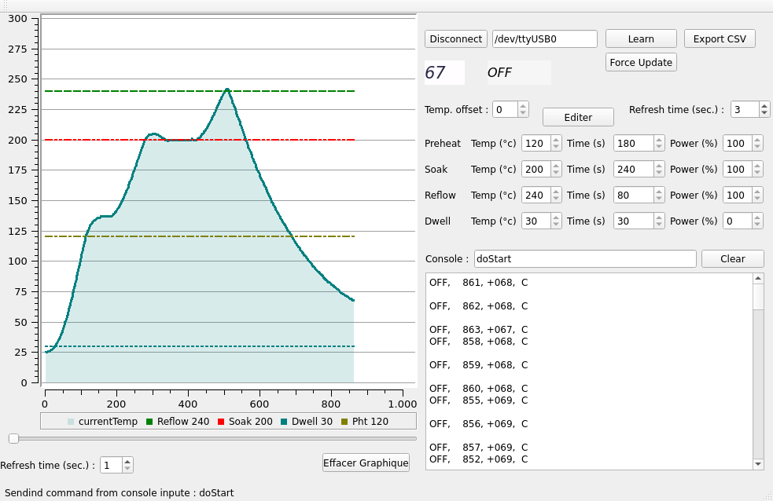

# Beta Layout Reflow Controller GUI
Software for the [Beta Layout reflow controller](https://uk.beta-layout.com/estore/order_product_details.html?wg=1&p=613): UART interface with simple GUI.



## Contact
Florian Boudinet
florian.boudinet@gmail.com


## Dependencies
This software needs [Qt5](https://www.qt.io/) and [Qwt](https://sourceforge.net/projects/qwt).

Debian:
```bash
apt install qtdeclarative5-dev libqt5svg5-dev libqwt-qt5-dev
```

Arch Linux:
```bash
pacman -Sy qwt
```

## Compilation
```bash
cd ${ReflowKitSource}
mkdir build
cd build
qmake ..
make
./ReflowKitController
```

Troubleshooting with the compilation: Perhaps you will have to edit the .pro file, to add and link Qwt properly, and adjust it to your settings (LD_PATH, Qwt source etc.).

## Usage
To start the reflow process after setting the temperature profile, enter "doStart" in the console text prompt and hit enter.


## UART
The software uses the RS232 UART protocol to communicate with the device.
Configuration: 9600 baud, 8 data bits, no parity, 1 bit stop, no handshake.

Path: For Linux, something like /dev/ttyUSBX.
For Windows, something like COM4, COM1…
Perhaps you will need to add some rights to use UART properly (root privilege, or add the current user to the /dev/tty permission).

Information on the controller, including valid commands, can be found in the [official documentation](https://us.beta-layout.com/download/rk/RK-10583_967.pdf).
